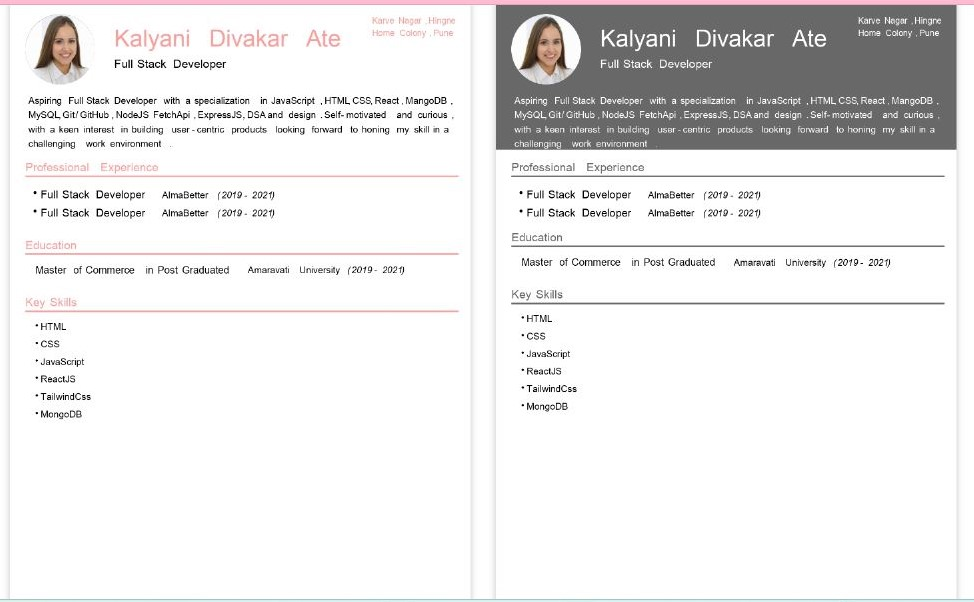
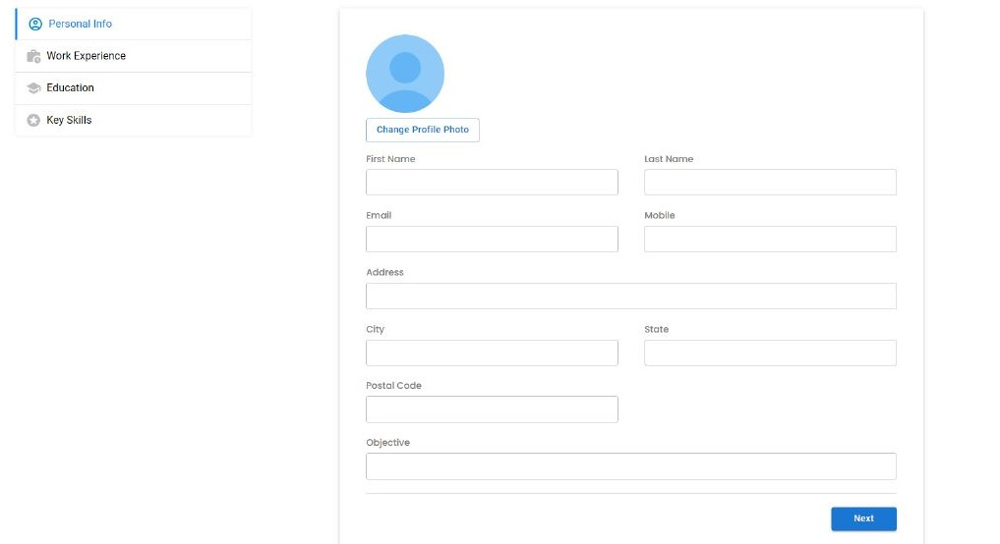
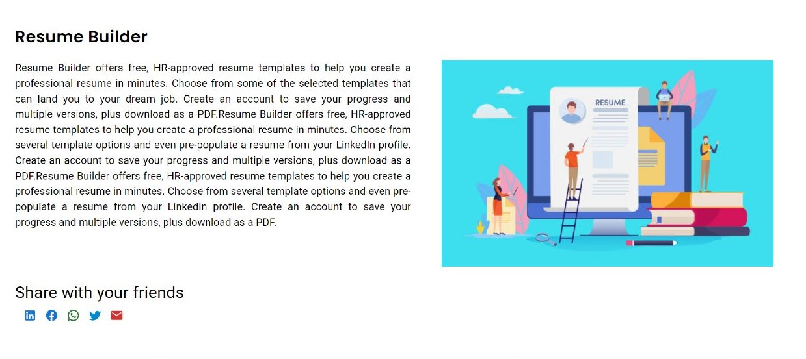

<h1># Resume_Builder_Project</h1>

In this project you will see two types of resume templates, both of which you can choose whichever you like and you can fill in your information and make a resume.

<h2>Deployment </h2>

The app has been deployed on <link>https://jovial-medovik-d15201.netlify.app/</link>

<h2>Demo Link <link>https://drive.google.com/file/d/1k4yB8g7LJxt94h8Vx6VENysh7rrgN0-M/view?usp=sharing<link/></h2>
<link>https://drive.google.com/file/d/1k4yB8g7LJxt94h8Vx6VENysh7rrgN0-M/view?usp=sharing<link/>

<h1>Features</h1>

Two Types of templates

Light Screen with Template Shadow

Responsive

<h3>Your information fill templates</h3>
<ul><li>Personal Information</li></ul>
<ul><li>Work Experience</li></ul>
<ul><li>Education</li></ul>
<ul><li>Key Skill</li></ul>
<ul><li>Next Buttons</li></ul>
<h2>Installation</h2>
<h3>npm Installation</h3>

npm install Resume_Builder_Project

cd Resume_Builder_Project

npm start

<h2>Screenshort</h2>

